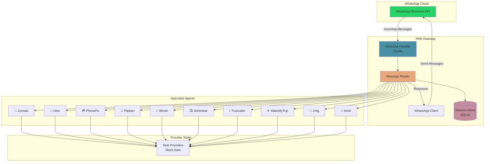

# PAM - Personal Agent Manager

> Your WhatsApp-based personal OS with 10 specialist agents

PAM transforms a WhatsApp group into your personal operating system. Instead of switching between apps, interact with specialist agents that handle different aspects of your daily life—all through natural conversation.

## 🎯 What is PAM?

PAM (Personal Agent Manager) is a WhatsApp bot that brings together 10 specialist agents, each simulating a popular Indian app:

| Agent | Icon | Service | Example Commands |
|-------|------|---------|------------------|
| Zomato | 🍔 | Food ordering | `@zomato order pizza`, `search biryani` |
| Uber | 🚗 | Ride booking | `@uber book cab to airport`, `track my ride` |
| PhonePe | 💳 | UPI payments | `@phonepe pay 500 to Rahul`, `check balance` |
| Flipkart | 🛒 | Shopping | `@flipkart search iphone`, `my orders` |
| Blinkit | 🛵 | Quick grocery | `@blinkit order milk`, `track delivery` |
| JioHotstar | 📺 | Streaming | `@jiohotstar trending`, `my watchlist` |
| Truecaller | 📞 | Caller ID | `@truecaller lookup 9876543210`, `spam report` |
| MakeMyTrip | ✈️ | Travel booking | `@makemytrip flights to goa`, `my trips` |
| 1mg | 💊 | Medicine | `@1mg search paracetamol`, `lab tests` |
| Airtel | 📱 | Recharge & bills | `@airtel recharge 299`, `check balance` |

## 🏗️ Architecture



## ⚠️ Important: Single Phone Number Constraint

**This is a v1 implementation using ONE WhatsApp Business number.**

Meta's WhatsApp Cloud API does not allow a single WhatsApp Business Account (WABA) to appear as multiple phone numbers. All 10 agents communicate through the same number, distinguished by:

- **Persona prefixes**: Each response starts with the agent's icon and name (e.g., `🍔 *Zomato*`)
- **@mention routing**: Users can direct messages with `@zomato`, `@uber`, etc.
- **Intent detection**: Natural language routing based on keywords

### Future Multi-Number Support

The architecture is designed for easy adaptation to multi-number setups:
- Each agent has its own package with isolated provider interfaces
- The router can be extended to support multiple WhatsApp clients
- Provider interfaces allow swapping stubs with real API integrations

## 🚀 Quick Start

### Prerequisites

- Node.js 20+
- pnpm 8+
- WhatsApp Business Account (for production)

### Installation

```bash
# Clone the repository
git clone https://github.com/Nithesh-b/pam.git
cd pam

# Install dependencies
pnpm install

# Build all packages
pnpm build

# Run tests
pnpm test
```

### Configuration

Copy the example environment file and configure:

```bash
cp .env.example .env
```

Required environment variables:

```env
# WhatsApp Cloud API credentials
WHATSAPP_ACCESS_TOKEN=your_access_token
WHATSAPP_PHONE_NUMBER_ID=your_phone_number_id
WHATSAPP_VERIFY_TOKEN=your_custom_verify_token
WHATSAPP_APP_SECRET=your_app_secret

# Server
PORT=3000
```

### Running Locally

```bash
# Development mode with hot reload
pnpm dev

# Production mode
pnpm start
```

The server will start on `http://localhost:3000`:
- `/` - API info
- `/webhook` - WhatsApp webhook endpoint
- `/health` - Health check

## 📱 WhatsApp Business Setup

### 1. Create Meta Developer Account

1. Go to [Meta for Developers](https://developers.facebook.com/)
2. Create a new app → Business type
3. Add WhatsApp product

### 2. Configure Webhook

1. In your Meta app dashboard, go to WhatsApp → Configuration
2. Set webhook URL: `https://your-domain.com/webhook`
3. Set verify token (same as `WHATSAPP_VERIFY_TOKEN`)
4. Subscribe to `messages` webhook field

### 3. Get Credentials

From your Meta app dashboard:
- **Access Token**: WhatsApp → API Setup → Generate token
- **Phone Number ID**: WhatsApp → API Setup → Phone number ID
- **App Secret**: Settings → Basic → App Secret

### 4. Test with Webhook URL

For local development, use a tunnel service like ngrok:

```bash
ngrok http 3000
```

## 🧪 Testing

```bash
# Run all tests
pnpm test

# Run specific package tests
pnpm --filter @pam/core test
pnpm --filter @pam/agent-zomato test
pnpm --filter @pam/agent-uber test
```

## 📦 Project Structure

```
pam/
├── apps/
│   └── gateway/          # Fastify webhook server
│       └── src/
│           ├── index.ts      # Entry point
│           ├── config.ts     # Configuration
│           ├── agents.ts     # Agent registration
│           └── webhook.ts    # Webhook handlers
├── packages/
│   ├── core/             # Router, session, types
│   │   └── src/
│   │       ├── router.ts     # Message routing
│   │       ├── session.ts    # SQLite sessions
│   │       ├── registry.ts   # Agent registry
│   │       └── types.ts      # Core types
│   ├── whatsapp/         # WhatsApp Cloud API client
│   │   └── src/
│   │       ├── client.ts     # API client
│   │       └── types.ts      # API types
│   └── agents/           # Specialist agents
│       ├── zomato/
│       ├── uber/
│       ├── phonepe/
│       ├── flipkart/
│       ├── blinkit/
│       ├── jiohotstar/
│       ├── truecaller/
│       ├── makemytrip/
│       ├── onemg/
│       └── airtel/
├── .env.example
├── package.json
├── pnpm-workspace.yaml
├── render.yaml
├── Dockerfile
└── README.md
```

## 🌐 Deployment

### Render (Recommended)

This project includes a `render.yaml` for easy deployment:

1. Connect your GitHub repository to Render
2. Create a new Web Service
3. Render will auto-detect the configuration
4. Add environment variables in Render dashboard
5. Deploy!

[](https://render.com/deploy)

### Docker

```bash
# Build the image
docker build -t pam .

# Run the container
docker run -p 3000:3000 \
  -e WHATSAPP_ACCESS_TOKEN=your_token \
  -e WHATSAPP_PHONE_NUMBER_ID=your_id \
  -e WHATSAPP_VERIFY_TOKEN=your_verify \
  pam
```

### Manual Deployment

Any Node.js hosting platform that supports:
- Node.js 20+
- Environment variables
- HTTPS (required for WhatsApp webhooks)

## 🔌 Extending PAM

### Adding a New Agent

1. Create a new package in `packages/agents/`:

```bash
mkdir -p packages/agents/myagent/src
```

2. Implement the Agent interface:

```typescript
import type { Agent, MessageContext, AgentResponse } from '@pam/core';

export class MyAgent implements Agent {
  readonly id = 'myagent';
  readonly name = 'MyAgent';
  readonly icon = '🎯';
  readonly description = 'My custom agent';
  readonly keywords = ['keyword1', 'keyword2'];

  async handleMessage(ctx: MessageContext): Promise<AgentResponse> {
    return { text: 'Hello from MyAgent!' };
  }

  getHelp(): string {
    return 'Help text for MyAgent';
  }
}
```

3. Register in `apps/gateway/src/agents.ts`:

```typescript
import { createMyAgent } from '@pam/agent-myagent';
registry.register(createMyAgent());
```

### Implementing Real Providers

Each agent has a Provider interface for real API integration:

```typescript
// packages/agents/zomato/src/provider.ts
export interface ZomatoProvider {
  searchRestaurants(query: string): Promise<Restaurant[]>;
  placeOrder(items: OrderItem[]): Promise<Order>;
  // ...
}

// Implement with real API
export class RealZomatoProvider implements ZomatoProvider {
  async searchRestaurants(query: string) {
    // Call real Zomato API
  }
}
```

## 🗺️ Roadmap

- [ ] **v1.1**: Persistent SQLite storage with file-based database
- [ ] **v1.2**: Real Zomato API integration
- [ ] **v1.3**: Uber/Ola API integration
- [ ] **v2.0**: Multi-number support with dedicated numbers per agent
- [ ] **v2.1**: Group chat support with smart agent routing
- [ ] **v3.0**: Voice message support with speech-to-text

## 🤝 Contributing

Contributions are welcome! Please read our contributing guidelines and submit PRs.

## 📄 License

MIT License - see [LICENSE](LICENSE) for details.

## ⚠️ Disclaimer

This is a demonstration project. All commerce features (ordering, payments, bookings) are **STUBBED** with mock data. No real transactions are processed. This project is not affiliated with any of the brands mentioned (Zomato, Uber, PhonePe, etc.).
